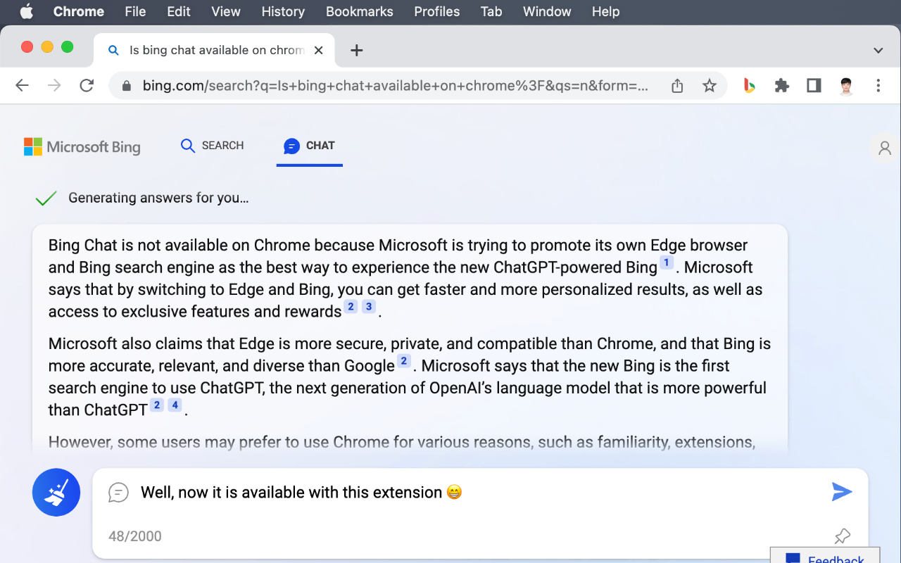
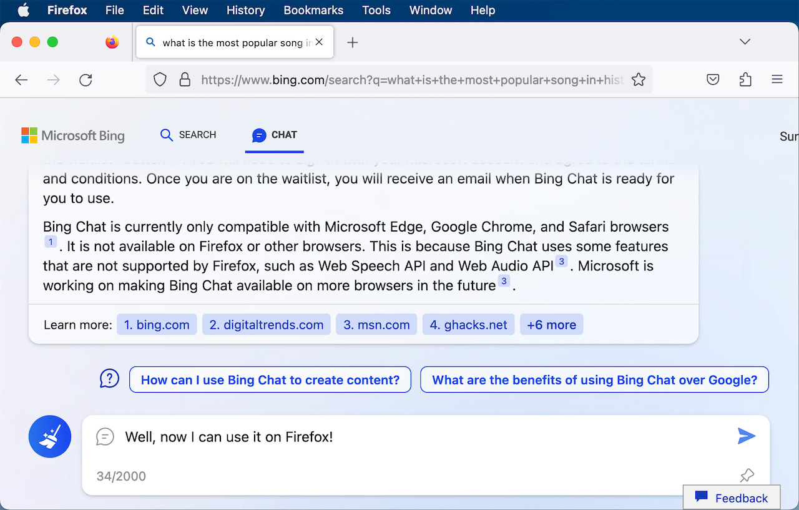

# Bing Chat for All Browsers

Use this extension to enable Bing Chat on all browsers!

| Chrome: [Download Now](https://chrome.google.com/webstore/detail/bing-chat-for-all-browser/jofbglonpbndadajbafmmaklbfbkggpo) | Firefox: [Download Now](https://addons.mozilla.org/en-US/firefox/addon/bing-chat-for-all-browsers/) |
| ---------------------------------------------------------------------------------------------------------------------------- | --------------------------------------------------------------------------------------------------- |
|                                                                               |                                                    |

> **Note** 
> You need a Microsoft account that has access to the new Bing Chat to use this extension.
> This extension cannot make you jump the queue to get access to the new Bing Chat!
> If you don't have access to the new Bing Chat, you can join the waitlist at [bing.com/chat](https://bing.com/chat).

## On Chrome

N/A. It should work out of the box!

## On Firefox

Set `layout.css.overflow-overlay.enabled` to true in about:config, and update to the latest version of Firefox. [Relevant Issue](https://github.com/anaclumos/bing-chat-for-all-browsers/issues/1)
